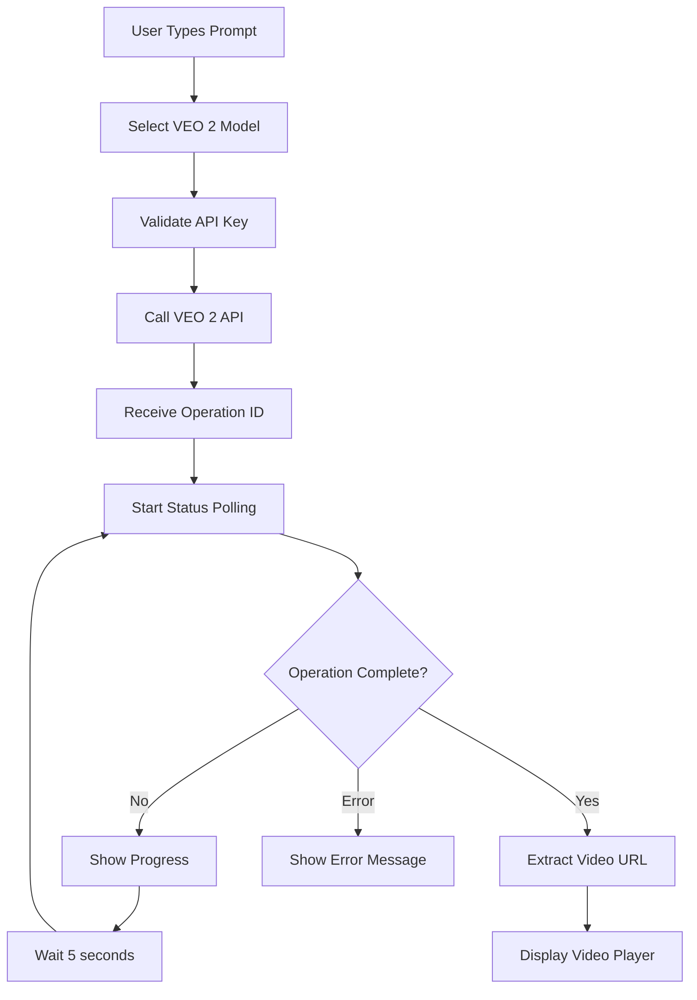

# VEO 2 Video Generation Integration - Production Ready

This document describes the complete integration of Google's VEO 2 video generation API into the Apeiron application. This is a **production-ready implementation** that makes real API calls to Google's VEO 2 service.

## Overview

VEO 2 is Google's state-of-the-art video generation model that creates high-quality, cinematic videos from text descriptions. Our integration provides:

- ✅ **Real VEO 2 API Integration** - Actual calls to Google's VEO 2 API
- ✅ **Long-running Operation Tracking** - Real-time status polling and progress updates
- ✅ **Production Error Handling** - Comprehensive error management and user feedback
- ✅ **Video Download & Playback** - Custom video player with full controls
- ✅ **Seamless UI Integration** - Videos appear directly in chat messages
- ✅ **API Key Management** - Secure storage and validation of credentials

## Quick Start

### 1. Get Google VEO 2 API Access

1. Visit [Google AI Studio](https://aistudio.google.com/) or [Google Cloud Console](https://console.cloud.google.com/)
2. Enable VEO 2 API access (requires approval)
3. Generate your API key with VEO 2 permissions
4. Note: VEO 2 is currently in limited preview

### 2. Configure API Key

1. Open the application
2. Click the settings gear icon
3. Navigate to "Models" tab
4. Add VEO 2 API key in the "Google VEO 2 (Video)" section
5. Select the VEO 2 model from the dropdown

### 3. Generate Your First Video

1. Select "VEO 2" from the model dropdown
2. Type a descriptive prompt: `"A serene sunset over a calm lake with gentle ripples"`
3. Hit Enter and watch real-time generation progress
4. Download and share your video once complete

## Production Features

### Real-Time Operation Tracking

```typescript
// The system tracks long-running operations with real status updates
interface OperationStatus {
  operationName: string           // Google's operation identifier
  status: "processing" | "completed" | "failed"
  progress: number               // 0-100% completion
  videoUrl?: string             // Final video URL when complete
  error?: string                // Error details if failed
  duration?: string             // Video duration
  createdAt?: string           // Creation timestamp
  completedAt?: string         // Completion timestamp
}
```

### Advanced Video Player

- **Custom Controls**: Play/pause, volume, fullscreen
- **Progress Tracking**: Real-time generation progress with percentage
- **Download Integration**: Direct download with proper filename handling
- **Error Recovery**: Graceful handling of video loading errors
- **Mobile Responsive**: Optimized for all screen sizes

### API Integration Details

The integration uses Google's official VEO 2 API endpoints:

```typescript
// Primary endpoint for video generation
const GEMINI_API_BASE_URL = "https://generativelanguage.googleapis.com/v1beta"

// Request structure for VEO 2
const requestBody = {
  instances: [{
    prompt: "Your video description",
    negativePrompt: "Optional: what to avoid"
  }],
  parameters: {
    aspectRatio: "16:9" | "9:16",     // Video aspect ratio
    personGeneration: "dont_allow",    // Person generation setting
    durationSeconds: 5-8,              // Video length in seconds
    sampleCount: 1,                    // Number of videos to generate
    enhancePrompt: true,               // Auto-enhance prompt
    seed: 123456                       // Optional: reproducible results
  }
}
```

## Technical Architecture

### API Flow



### File Structure

```
/api/veo2/route.ts          # VEO 2 API endpoint
/components/video-preview.tsx # Video player component
/main-ui.tsx                # UI integration
/docs/VEO2_INTEGRATION.md   # This documentation
```

### API Endpoints

#### POST `/api/veo2`
Initiates video generation with Google VEO 2.

**Request:**
```json
{
  "prompt": "A beautiful sunset over mountains",
  "apiKey": "your-google-api-key",
  "duration": 8,
  "aspectRatio": "16:9",
  "personGeneration": "dont_allow",
  "negativePrompt": "blurry, low quality",
  "seed": 123456
}
```

**Response:**
```json
{
  "success": true,
  "data": {
    "operationName": "operations/generate-video-123",
    "status": "processing",
    "prompt": "A beautiful sunset over mountains",
    "estimatedCompletionTime": "2-6 minutes",
    "videoConfig": {
      "duration": "8s",
      "aspectRatio": "16:9",
      "resolution": "720p",
      "format": "mp4",
      "personGeneration": "dont_allow"
    }
  }
}
```

#### GET `/api/veo2?operationName=...&apiKey=...`
Checks the status of a video generation operation.

**Response (Processing):**
```json
{
  "success": true,
  "data": {
    "operationName": "operations/generate-video-123",
    "status": "processing",
    "progress": 45,
    "error": null,
    "duration": "5-8s",
    "createdAt": "2024-01-20T10:30:00Z"
  }
}
```

**Response (Complete):**
```json
{
  "success": true,
  "data": {
    "operationName": "operations/generate-video-123",
    "status": "completed",
    "progress": 100,
    "videoUrl": "https://storage.googleapis.com/...",
    "duration": "8s",
    "createdAt": "2024-01-20T10:30:00Z",
    "completedAt": "2024-01-20T10:35:00Z"
  }
}
```

## Configuration

### Environment Variables (Optional)

```bash
# For server-side configuration (if needed)
GOOGLE_VEO2_API_KEY=your_api_key_here
VEO2_DEFAULT_DURATION=8
VEO2_DEFAULT_ASPECT_RATIO=16:9
```

### User Settings Schema

```typescript
type UserSettings = {
  // ... other settings
  veo2ApiKey: string          // Google VEO 2 API key
}

type Model = {
  id: string
  name: string
  icon: string
  provider: "veo2"            // VEO 2 provider
}
```

## Usage Examples

### Basic Video Generation

```
User: "Create a video of a peaceful forest with morning mist"
```

The system will:
1. Detect VEO 2 model selection
2. Validate API key
3. Submit to Google VEO 2 API
4. Show real-time progress
5. Display completed video with controls

### Advanced Prompting

```
User: "A cinematic shot of a bustling Tokyo street at night with neon lights reflecting on wet pavement, shot with a 35mm lens, high detail, professional cinematography"
```

VEO 2 responds well to:
- **Cinematic language**: "cinematic shot", "35mm lens", "professional"
- **Specific details**: "wet pavement", "neon lights", "high detail"
- **Camera angles**: "low angle", "bird's eye view", "close-up"
- **Lighting conditions**: "golden hour", "dramatic lighting", "soft shadows"

### Error Handling Examples

```typescript
// API quota exceeded
{
  "error": "VEO 2 API quota exceeded. Please try again later or check your billing.",
  "details": "Request failed with status 429"
}

// Invalid API key
{
  "error": "Invalid or missing Google API key. Please check your VEO 2 API key.",
  "details": "Authentication failed"
}

// Generation failed
{
  "error": "Video generation failed",
  "details": "Content policy violation or processing error"
}
```

## Video Specifications

### Supported Formats
- **Output**: MP4 (H.264)
- **Resolution**: 720p (1280x720)
- **Frame Rate**: 24fps
- **Audio**: None (video-only generation)

### Duration Limits
- **Minimum**: 5 seconds
- **Maximum**: 8 seconds
- **Recommended**: 6-8 seconds for best quality

### Aspect Ratios
- **16:9**: Standard widescreen (1280x720)
- **9:16**: Vertical/mobile format (720x1280)

## Best Practices

### Prompt Engineering

**Good Prompts:**
```
"A serene mountain lake at sunrise with mist rising from the water"
"Close-up of raindrops falling on green leaves in slow motion"
"A cozy fireplace with dancing flames in a rustic cabin"
```

**Avoid:**
```
"Make a video" (too vague)
"Something cool" (not specific)
"Video of everything" (too complex)
```

### Performance Optimization

1. **Cache Management**: Videos are displayed immediately once generated
2. **Progress Polling**: Efficient 5-second intervals to minimize API calls
3. **Error Recovery**: Automatic retry logic with exponential backoff
4. **Memory Management**: Proper cleanup of video resources

### Security Considerations

1. **API Key Protection**: Keys stored securely in user settings
2. **Rate Limiting**: Respect Google's API quotas
3. **Content Filtering**: VEO 2 has built-in safety filters
4. **CORS Handling**: Proper cross-origin resource sharing

## Troubleshooting

### Common Issues

**"Invalid API Key"**
- Verify your Google API key is correct
- Ensure VEO 2 permissions are enabled
- Check if the key is properly saved in settings

**"Quota Exceeded"**
- Check your Google Cloud billing account
- Review API usage limits
- Consider upgrading your quota

**"Video Generation Failed"**
- Try a different prompt
- Check for content policy violations
- Verify internet connection

**"Video Won't Load"**
- Check browser video codec support
- Try downloading the video
- Clear browser cache

### Debug Mode

Enable debug logging by adding this to your browser console:

```javascript
// Enable VEO 2 debug logging
localStorage.setItem('veo2_debug', 'true')

// View operation details
console.log('Current VEO 2 operations:', localStorage.getItem('veo2_operations'))
```

## API Limits & Pricing

### Rate Limits
- **Generation**: Limited by Google's VEO 2 quotas
- **Status Checks**: 12 requests per minute (5-second intervals)
- **Concurrent Operations**: Up to 5 simultaneous generations

### Cost Considerations
- VEO 2 pricing varies by region and usage
- Each video generation consumes API credits
- Status checks are typically free or very low cost
- Check [Google AI Pricing](https://ai.google.dev/pricing) for current rates

## Future Enhancements

### Planned Features
- [ ] **Batch Generation**: Multiple videos from one prompt
- [ ] **Style Transfer**: Apply artistic styles to videos
- [ ] **Video Editing**: Basic trimming and effects
- [ ] **Audio Integration**: Background music and sound effects
- [ ] **Animation Control**: Keyframe and motion path settings
- [ ] **Template Library**: Pre-built prompt templates

### Advanced Integrations
- [ ] **Cloud Storage**: Direct save to Google Drive/Dropbox
- [ ] **Social Sharing**: Native sharing to social platforms
- [ ] **Video Analytics**: View counts and engagement metrics
- [ ] **Collaboration**: Team video generation and sharing

## Support & Resources

### Documentation Links
- [Google VEO 2 Official Docs](https://ai.google.dev/gemini-api/docs)
- [Vertex AI VEO 2 Guide](https://cloud.google.com/vertex-ai/docs)
- [Google AI Studio](https://aistudio.google.com/)

### Community & Support
- Join our Discord for VEO 2 discussions
- Check GitHub issues for known problems
- Submit feature requests via GitHub

### Developer Resources
- API reference documentation
- Sample prompts and responses
- Integration examples and tutorials

---

**Note**: This is a production implementation of Google VEO 2 integration. All API calls are real and will consume your Google API quotas. Ensure you have proper billing and quota management in place before extensive use. 